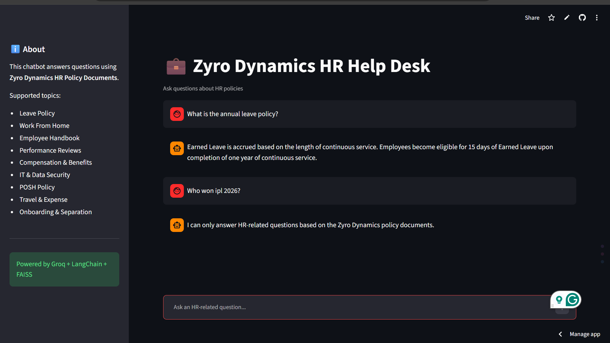

# Zyro Dynamics HR Help Desk

An AI-powered HR Help Desk built using **Retrieval-Augmented Generation (RAG)** that answers employee HR policy questions by retrieving information from company HR policy documents. The chatbot provides grounded responses, cites source documents, and refuses unrelated queries.

## Live Demo

https://zyro-dynamics-hr-appdesk-eajzdehbnu3ae2847zfbbc.streamlit.app/

## Application Preview



## Features

- AI-powered HR chatbot
- Retrieval-Augmented Generation (RAG)
- Semantic search using FAISS
- PDF document ingestion and indexing
- Source document references for every response
- Restricts responses to HR policy documents
- Fast inference using Groq Llama 3.3 70B
- LangSmith tracing for observability
- Streamlit web interface

---

## Tech Stack

- Python
- Streamlit
- LangChain
- FAISS
- HuggingFace Embeddings
- Groq (Llama 3.3 70B)
- LangSmith
- PyPDF

---

## Documents Used

- Company Profile
- Employee Handbook
- Leave Policy
- Work From Home Policy
- Code of Conduct
- Performance Review Policy
- Compensation & Benefits Policy
- IT & Data Security Policy
- Prevention of Sexual Harassment (POSH) Policy
- Onboarding & Separation Policy
- Travel & Expense Policy

---

## Project Structure

```text
.
├── assets/
│   └── demo.png
├── app.py
├── requirements.txt
├── README.md
├── 00_Company_Profile.pdf
├── 01_Employee_Handbook.pdf
├── ...
└── 10_Travel_and_Expense_Policy.pdf
```

---

## Getting Started

### Clone the repository

```bash
git clone https://github.com/AithagoniAkshitha-22/zyro-dynamics-hr-helpdesk.git
cd zyro-dynamics-hr-helpdesk
```

### Install dependencies

```bash
pip install -r requirements.txt
```

### Configure Secrets

Create a `.streamlit/secrets.toml` file:

```toml
GROQ_API_KEY = "your_groq_api_key"
```

### Run the application

```bash
streamlit run app.py
```

---

## Example Questions

- What is the annual leave policy?
- How does the performance review process work?
- What is the work-from-home policy?
- What are the employee onboarding steps?
- What is the travel reimbursement policy?

---

## Author

**Akshitha Aithagoni**

- GitHub: https://github.com/AithagoniAkshitha-22
- LinkedIn: https://www.linkedin.com/in/akshithaaithagoni223/

---

If you found this project useful, consider giving it a ⭐ on GitHub.
